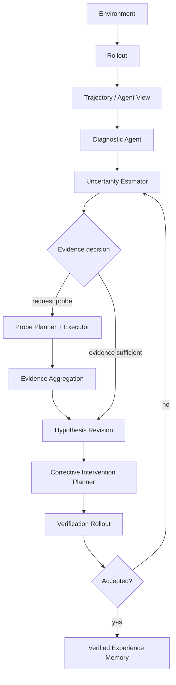

# Active-Evidence Embodied Research Agent

> How can an embodied agent actively acquire diagnostic evidence after a failed
> rollout, generate hypotheses about latent execution failures, and improve
> subsequent rollouts through iterative reasoning?

This repository studies an **Embodied Research Agent**, not a learned robot
controller. MetaWorld `push-v3` and its scripted `SawyerPushV3Policy` provide a
controlled experimental platform. The research object is the high-level agent
that observes failure, estimates what it does not know, requests informative
interaction, updates mechanism hypotheses, proposes a bounded corrective
intervention, and accepts it only after a verification rollout.

## Why active evidence?

A failed trajectory is often compatible with several mechanisms: systematic
execution bias, stochastic control noise, delayed response, contact mismatch, or
perception error. Passive diagnosis forces the agent to choose from evidence that
may be insufficient. Active evidence acquisition makes the missing-information
decision explicit:

```text
failed rollout
  -> uncertainty estimate
  -> request more evidence OR update hypothesis directly
  -> diagnostic probe
  -> evidence aggregation
  -> hypothesis revision
  -> corrective intervention
  -> verification rollout
  -> accept/reject
  -> verified experience only
```

The low-level manipulation policy remains mostly fixed. Intelligence is evaluated
through diagnostic accuracy, evidence efficiency, hypothesis calibration,
verification success, rollout improvement, and interaction cost—not only task
success or reward.

## Research principles

- **Causal information boundary:** agent modules consume schema-v2 Agent View;
  injected fault parameters and executed-action audit fields remain Oracle-only.
- **Explicit evidence decision:** probing requires a recorded uncertainty estimate
  and an explicit evidence-acquisition decision.
- **Hypotheses are mechanisms, not labels:** they include predictions, confidence,
  supporting evidence, and contradicting evidence.
- **Verification before memory:** unverified interventions cannot become reusable
  experience.
- **Negative results are evidence:** failed gates and counterexamples are preserved
  rather than hidden or retuned away.

## Current evidence

The repository already provides reproducible rollout/video/trajectory pipelines,
controlled masked perturbations, leakage-safe trajectory views, progress metrics,
active directional probes, bounded interventions, online model adapters, and
paired evaluation controls.

Two recent development results motivate the refocus:

- The online GLM-5.1 candidate-utility agent recovered 5/6 frozen tuning cases,
  matched a simple probe-greedy rule on all six decisions, and underperformed fixed
  compensation at 6/6.
- Extending one candidate probe from 80 to 500 steps did not improve recovery above
  5/6; candidate ranking reversed across stochastic execution realizations while
  interaction cost increased.

These results do not establish general agent performance. They identify a concrete
question: how should an agent allocate evidence budget when one stochastic probe
does not estimate future recovery utility?

## Architecture



See [research question](docs/research_question.md),
[architecture](docs/architecture.md), and [terminology](docs/terminology.md).

## Reproduce the platform

Python 3.10, MetaWorld 3.1.1, and MuJoCo are used on CPU by default.

```powershell
py -3.10 -m venv .venv
.\.venv\Scripts\Activate.ps1
python -m pip install -r requirements.txt
python scripts/check_install.py
python scripts/demo_push.py
python scripts/evaluate_push.py --num-episodes 10 --seed-start 100
```

The demo writes `outputs/push_demo.mp4` and a schema-v2 JSONL trajectory. Exact
experiment commands, online-agent wrappers, artifact paths, and validation commands
are in [docs/reproduction.md](docs/reproduction.md). Installation troubleshooting
is in [INSTALL.md](INSTALL.md).

## Repository map

```text
src/
  rollout/         environment execution only
  trajectory/      transition records and Agent/Oracle views
  diagnosis/       mechanism hypotheses and revisions
  uncertainty/     uncertainty estimates and evidence decisions
  probe/           diagnostic probe contracts and implementations
  reasoning/       research-cycle state and evidence flow
  planner/         corrective-intervention contracts
  verification/    verification plans and outcomes
  memory/          verified-experience contract only
  evaluation/      research metrics and audit schemas
  visualization/   figure/video artifact contracts
scripts/           reproducible experiment entrypoints
reports/           immutable experiment reports and negative results
```

## Scope and limitations

The present evidence comes from one MetaWorld task, a scripted low-level policy,
controlled execution faults, and simulation. It does not establish transfer to
real robots, general manipulation, learned policies, or open-world diagnosis.
Memory retrieval, reinforcement learning, behavior cloning, VLA training, and new
robot tasks are intentionally outside the current architecture milestone.

---

# 主动证据具身研究 Agent

> 具身 Agent 如何在一次 rollout 失败后，主动获取诊断证据、提出潜在执行故障假设，
> 并通过迭代推理改进后续 rollout？

本仓库研究的是 **Embodied Research Agent**，而不是新的机器人控制器。MetaWorld
`push-v3` 与固定的 `SawyerPushV3Policy` 只是可控实验平台。真正的研究对象是高层
Agent：观察失败、估计未知信息、决定是否需要额外交互、更新机制假设、提出有限的
corrective intervention，并通过 verification rollout 决定是否接受。

## 为什么需要主动证据？

同一条失败轨迹可能同时符合执行偏差、随机控制噪声、响应延迟、接触不匹配或感知误差。
被动诊断只能使用已经存在、但可能不充分的轨迹。主动证据获取把“还缺少什么信息”变成
Agent 的显式决策：

```text
失败 rollout
  -> 不确定性估计
  -> 请求更多证据 / 直接更新假设
  -> 诊断 probe
  -> 证据聚合
  -> 假设修订
  -> corrective intervention
  -> verification rollout
  -> 接受 / 拒绝
  -> 只保存经过验证的经验
```

低层操作策略保持基本固定。核心指标是诊断准确性、证据效率、假设校准、验证成功率、
rollout 改进和交互成本，而不是只看 reward 或 Push 成功率。

## 研究原则

- Agent 模块只能读取 schema-v2 Agent View；人工注入故障和执行动作审计字段只供 Oracle
  评测使用。
- probe 必须由不确定性估计和显式 evidence-acquisition decision 授权。
- hypothesis 是带有预测、置信度和证据来源的机制解释，不是 Oracle failure label。
- corrective intervention 只有通过 verification rollout 后才能写入 memory。
- 失败实验、反例和未通过的 promotion gate 都作为科研证据保留。

## 当前真实证据

仓库已经具备可复现 rollout、视频、轨迹、受控扰动、Agent/Oracle 数据边界、任务进度
指标、方向性主动 probe、有限 intervention、在线模型接口和配对对照评测。

最近两个 development 结果推动了本次研究重构：

- 在线 GLM-5.1 候选效用 Agent 在六个冻结 tuning case 中恢复 5/6，与简单
  probe-greedy 规则的六次选择完全一致，并低于固定补偿的 6/6。
- 将单条候选 probe 从 80 步延长到 500 步仍只有 5/6；随机执行 realization 之间发生
  候选排序反转，同时交互成本显著增加。

这些结果不能证明通用 Agent 性能，但明确提出了下一问题：当单次随机 probe 无法估计
未来恢复效用时，Agent 应如何分配证据预算？

## 架构与复现

总体架构与英文部分一致，详细信息见：

- [研究问题](docs/research_question.md)
- [系统架构](docs/architecture.md)
- [统一术语](docs/terminology.md)
- [完整复现命令](docs/reproduction.md)
- [安装说明](INSTALL.md)

快速运行：

```powershell
py -3.10 -m venv .venv
.\.venv\Scripts\Activate.ps1
python -m pip install -r requirements.txt
python scripts/check_install.py
python scripts/demo_push.py
python scripts/evaluate_push.py --num-episodes 10 --seed-start 100
```

默认 demo 视频位于 `outputs/push_demo.mp4`。当前结论只来自单一 MetaWorld 任务、脚本
策略、受控故障与仿真环境，尚不代表真实机器人、开放世界诊断或通用操作能力。
