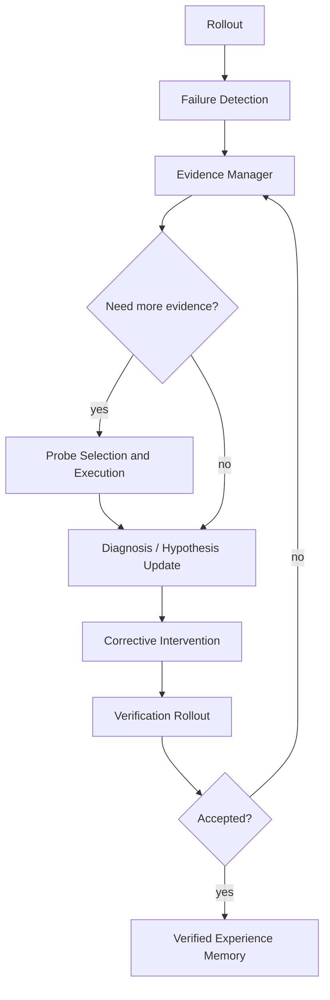

# Active Evidence Acquisition for Self-Improving Embodied Agents

> Can an embodied agent recognize when a failed rollout is diagnostically
> ambiguous, acquire only the missing evidence, and verify a corrective
> intervention before treating it as reusable experience?

This repository is a research prototype for **active evidence acquisition after
robotic failure**. MetaWorld `push-v3` and the fixed `SawyerPushV3Policy` are the
experimental platform; the research object is the high-level agent that decides
whether its current evidence is sufficient, which diagnostic interaction is worth
its cost, and whether a proposed intervention is actually supported by a fresh
verification rollout.

The project is not a new manipulation policy, a reinforcement-learning baseline,
or a MetaWorld tutorial. Its intended research chain is:

```text
controlled failure
-> agent-visible trajectory
-> uncertainty about the failure mechanism
-> probe or diagnose directly
-> corrective intervention
-> verification rollout
-> verified experience only
```

## Research problem

A failed task trajectory often identifies a symptom without uniquely identifying
its cause. Similar lack of progress can arise from systematic action bias,
stochastic execution noise, weakened action scale, contact mismatch, delayed
response, or inaccurate perception. A passive diagnostic system must commit using
whatever motion the nominal policy happened to generate, even when those actions
do not sufficiently excite the relevant dynamics.

Active evidence acquisition instead asks:

1. What competing failure hypotheses remain plausible?
2. How uncertain is the current diagnosis?
3. Would a bounded probe distinguish those hypotheses?
4. Is the expected information worth the interaction cost?
5. Does the resulting intervention pass an independent verification rollout?

The immediate scientific target is not maximum Push success. It is improved
**diagnostic accuracy and evidence efficiency under a fixed interaction budget**.

See the canonical [problem definition](docs/problem_definition.md).

## Agent architecture



The low-level policy remains mostly fixed. The intelligent component operates over
rollouts and bounded probes rather than generating unconstrained continuous robot
actions. Full responsibilities and information flow are documented in
[agent architecture](docs/agent_architecture.md).

## Causal information boundary

Agent decisions consume only schema-v2 **Agent View** evidence:

- `observation_t`, `commanded_action_t`, and `observation_t+1`;
- reward, success, termination, and truncation;
- task-progress metrics and evidence provenance;
- declared environment-step and decision budgets.

Injected fault type, bias axis or magnitude, perturbed/executed actions, and
clipping fields are **Oracle View** information. They may configure the simulator
and score results after execution, but they may not enter diagnosis, probe
selection, or intervention planning.

## What is implemented

| Research role | Current implementation | Status |
|---|---|---|
| Rollout | MetaWorld episode execution, video, and task metrics | Implemented |
| Trajectory | Aligned schema-v2 transitions and Agent/Oracle projections | Implemented |
| Failure generation | Masked action bias, Gaussian noise, and action scaling | Implemented |
| Failure detection | Task success and progress-based outcome checks | Rule-based |
| Evidence manager | Uncertainty records, probe authorization, and bounded campaigns | Partial |
| Probe selection | Symmetric and repeated directional probe contracts | Partial |
| Diagnosis | Mechanism hypotheses and passive planar estimation | Partial |
| Correction | Bounded planar corrective skills | Implemented baseline |
| Verification | Fresh rollout and accepted/rejected/inconclusive contracts | Partial |
| Memory | Verified-only storage interface | Interface only |

Fault injection and Oracle audit are experimental infrastructure, not powers
available to the Agent. Existing online-model adapters are retained as optional
historical comparisons; active evidence acquisition is the research contribution,
not the choice of language model.

## Current empirical evidence

The repository preserves positive and negative results rather than presenting
integration pilots as general performance claims.

- Controlled single-axis perturbation experiments established reproducible
  failures, schema-v2 trajectories, real CSV summaries, and representative videos.
- A bounded online GLM-5.2 pilot demonstrated that an external model can select a
  registered diagnostic probe without receiving Oracle fault fields.
- In a five-case development comparison, GLM-5.2 requested a probe for all 5/5
  cases, behaving like an always-probe policy rather than a selective evidence
  allocator.
- A frozen uncertainty gate reduced probe use on ten held-out single-axis cases,
  but passive correction already succeeded on 10/10. The extra probes produced no
  success gain.

The current conclusion is therefore deliberately modest: the experimental loop is
reproducible, but simple single-axis bias does not yet demonstrate a scientific
need for active evidence. The next benchmark must use **ambiguity pairs**, such as
stable bias versus stochastic noise, where passive trajectories can support
multiple mechanisms and probe consistency can resolve them.

Reports containing the actual commands and artifacts are under `reports/`. The
[experiment plan](docs/experiment_plan.md) defines the next controlled comparisons.

## Repository map

```text
src/
  rollout/         execute episodes; no diagnosis
  trajectory/      causal transition records and data views
  diagnosis/       failure hypotheses and visible-state estimators
  uncertainty/     evidence sufficiency and probe decisions
  probe/           bounded diagnostic interaction contracts
  planner/         corrective-intervention contracts
  verification/    verification plans and outcomes
  memory/          verified-experience interface only
  evaluation/      resumable campaigns and research metrics
scripts/           reproducible experiment and visualization entrypoints
configs/           frozen campaign configurations
reports/           real experiment reports, including negative results
docs/              canonical research and reproduction documentation
```

## Reproduction

The project uses Python 3.10, MetaWorld 3.1.1, and MuJoCo on CPU by default.

```powershell
py -3.10 -m venv .venv
.\.venv\Scripts\Activate.ps1
python -m pip install -r requirements.txt
python scripts/check_install.py
python scripts/demo_push.py
python scripts/evaluate_push.py --num-episodes 10 --seed-start 100
```

The default demo writes `outputs/push_demo.mp4`. Exact baseline, perturbation,
active-evidence, validation, and optional online-comparison commands are in
[docs/reproduction.md](docs/reproduction.md). Installation details are in
[INSTALL.md](INSTALL.md).

## Scope and limitations

Current evidence is limited to one simulated manipulation task, a scripted
low-level policy, and controlled execution faults. It does not establish
open-world diagnosis, transfer to a real robot, learned manipulation, or
memory-based continual improvement. No reinforcement learning, behavior cloning,
VLA training, or new robot task is part of the current research milestone.

---

# 面向自改进具身智能体的主动证据获取

> 具身智能体能否在一次机器人 rollout 失败后，识别当前证据是否存在诊断歧义，
> 只获取真正缺失的信息，并在将纠正经验用于未来之前通过新的 rollout 验证它？

本仓库是一个研究**机器人失败后主动获取诊断证据**的原型系统。MetaWorld
`push-v3` 和固定的 `SawyerPushV3Policy` 是受控实验平台；真正的研究对象是高层
Agent：它需要判断现有证据是否充分、哪一种诊断性交互值得消耗预算，以及一个纠正方案
是否得到了新 verification rollout 的真实支持。

本项目不是新的机器人操作策略、强化学习 baseline 或 MetaWorld 教程。预期研究链条为：

```text
可控失败
-> Agent 可见轨迹
-> 对失败机制的不确定性
-> 主动 probe 或直接诊断
-> corrective intervention
-> verification rollout
-> 只保留经过验证的经验
```

## 研究问题

一次失败轨迹通常只能揭示失败症状，不能唯一确定失败原因。相似的任务停滞可能来自固定
动作偏差、随机执行噪声、动作幅度衰减、接触动力学不匹配、控制延迟或感知误差。被动
诊断器只能使用 nominal policy 恰好产生的动作和状态变化；当这些动作没有充分激励相关
动力学时，诊断结论可能缺乏可辨识性。

主动证据获取将问题改写为：

1. 当前仍有哪些相互竞争的失败机制假设？
2. 诊断不确定性有多大？
3. 一个有限步数的 probe 能否区分这些假设？
4. 预期信息增益是否值得额外交互成本？
5. 根据新证据生成的 intervention 能否通过独立 verification rollout？

当前科学目标不是单纯提高 Push 成功率，而是在固定交互预算下提高**诊断准确率和证据
效率**。规范定义见[问题定义](docs/problem_definition.md)。

## Agent 架构

```text
Rollout
-> Failure Detection
-> Evidence Manager
-> Probe Selection（必要时）
-> Diagnosis
-> Corrective Intervention
-> Verification
-> Verified Experience Memory
```

底层操作策略保持基本固定。Agent 在 rollout 与有限 probe 层面决策，不直接生成不受约束
的连续机器人动作。完整职责、输入输出和信息流见
[Agent 架构](docs/agent_architecture.md)。

## 因果信息边界

Agent 只能读取 schema-v2 **Agent View**：

- `observation_t`、`commanded_action_t` 和 `observation_t+1`；
- reward、success、terminated 和 truncated；
- 任务进度指标、证据来源和显式预算。

注入故障类型、bias 轴与幅度、perturbed/executed action 和裁剪审计字段属于
**Oracle View**。它们只允许用于配置仿真和事后评测，不能进入诊断、probe 选择或
intervention 规划。

## 当前实现

| 研究环节 | 当前实现 | 状态 |
|---|---|---|
| Rollout | MetaWorld episode、视频和任务指标 | 已实现 |
| Trajectory | schema-v2 状态转移和 Agent/Oracle View | 已实现 |
| 失败构造 | masked action bias、Gaussian noise、action scale | 已实现 |
| Failure Detection | success 与 task progress 规则 | 规则基线 |
| Evidence Manager | uncertainty、probe 授权和预算 campaign | 部分实现 |
| Probe Selection | 对称方向 probe 与重复 probe 合同 | 部分实现 |
| Diagnosis | 机制假设和被动平面漂移估计 | 部分实现 |
| Correction | 有限平面纠正 skill | 基线已实现 |
| Verification | 新 rollout 与三态验证合同 | 部分实现 |
| Memory | 只允许 verified experience 的接口 | 仅接口 |

故障注入和 Oracle audit 是实验基础设施，不是 Agent 能力。仓库保留已有在线模型适配器
作为可选历史对照，但项目的核心研究贡献是主动证据获取，而不是某一个语言模型。

## 当前真实证据

仓库明确保留正结果和负结果，不把 integration pilot 包装成通用性能结论。

- 单轴可控扰动实验建立了可复现失败、schema-v2 轨迹、真实 CSV 和代表性视频。
- 一次受约束 GLM-5.2 pilot 证明外部模型可以在不知道 Oracle 故障字段的情况下选择已注册
  diagnostic probe。
- 在五个 development cases 中，GLM-5.2 对 5/5 全部请求 probe，实际表现更接近
  always-probe，而不是选择性证据分配策略。
- 冻结 uncertainty gate 在十个 held-out 单轴 cases 上减少了 probe，但 passive correction
  已经达到 10/10，额外 probe 没有增加成功数。

因此当前结论是：实验闭环已经可复现，但简单单轴 bias 尚不能证明 active evidence 的科学
必要性。下一步需要构造 **ambiguity pairs**，例如 stable bias 与 stochastic noise：二者的
被动失败现象相似，但重复 probe 的一致性能够帮助区分潜在机制。

真实命令、结果和限制位于 `reports/`；下一阶段对照与指标见
[实验计划](docs/experiment_plan.md)。

## 仓库结构

```text
src/rollout/       只负责执行 episode
src/trajectory/    因果轨迹和 Agent/Oracle View
src/diagnosis/     失败机制假设和可见状态估计
src/uncertainty/   证据充分性与 probe 决策
src/probe/         有限诊断性交互
src/planner/       corrective intervention 合同
src/verification/  verification 计划和结果
src/memory/        verified experience 接口
src/evaluation/    可续跑 campaign 与科研指标
scripts/           可复现实验和可视化入口
configs/           冻结实验配置
reports/           真实实验报告和负结果
docs/              规范研究文档与复现说明
```

## 快速复现

```powershell
py -3.10 -m venv .venv
.\.venv\Scripts\Activate.ps1
python -m pip install -r requirements.txt
python scripts/check_install.py
python scripts/demo_push.py
python scripts/evaluate_push.py --num-episodes 10 --seed-start 100
```

默认演示视频保存到 `outputs/push_demo.mp4`。完整 baseline、扰动、主动证据和可选在线对照
命令见[复现说明](docs/reproduction.md)，安装细节见 [INSTALL.md](INSTALL.md)。

## 范围与限制

当前证据只来自一个仿真操作任务、脚本底层策略和受控执行故障，尚不能证明开放世界诊断、
真实机器人迁移、学习型操作策略或基于 memory 的持续自改进。当前研究阶段不包含强化学习、
行为克隆、VLA 训练或新的机器人任务。
