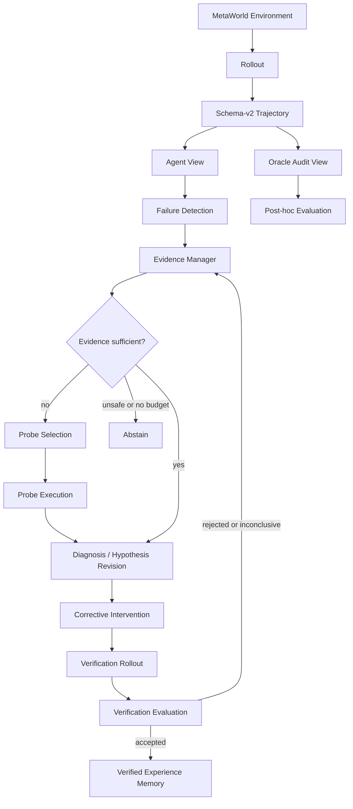

# Agent Architecture

## Design principle

The system separates robot execution, Agent-visible reasoning, and Oracle-only
evaluation. Rollout code executes actions and records transitions. Research-agent
modules decide what evidence is missing and what bounded intervention to test.
Experimental fault injection and labels never enter the Agent decision path.

## Component responsibilities

### 1. Rollout

**Responsibility:** reset the environment, query the mostly fixed policy, apply the
configured experimental execution process, step the environment, and return episode
metrics.

**Inputs:** environment, policy, seed, maximum steps, optional perturbation and
artifact paths.

**Outputs:** schema-v2 transitions, video when requested, and `EpisodeResult`.

**Current code:** `src/rollout` and `src/task_metrics.py`.

**Status:** implemented. It must not diagnose failure or select a probe.

### 2. Failure Detection

**Responsibility:** decide whether post-failure reasoning is required and summarize
the observable symptom.

**Inputs:** success/termination flags and Agent-visible task-progress metrics.

**Outputs:** failure evidence packet or successful-cycle closure.

**Current code:** task outcome checks in rollout/campaign entrypoints rather than a
standalone detector.

**Status:** rule-based baseline. No learned failure detector is claimed.

### 3. Evidence Manager

**Responsibility:** track available evidence, uncertainty, provenance, and remaining
interaction budget; authorize exactly one of direct hypothesis update, probe, or
abstention.

**Inputs:** Agent View failure evidence, current hypotheses, and budgets.

**Outputs:** explicit evidence-acquisition decision with rationale and probe budget.

**Current code:** `src/uncertainty`, `src/reasoning`, and resumable campaign budgets
in `src/evaluation`.

**Status:** partial. Transparent threshold and optional historical online policies
exist, but no general uncertainty algorithm is claimed.

### 4. Probe Selection

**Responsibility:** select a bounded interaction whose predicted outcome can
distinguish current hypotheses.

**Inputs:** authorized probe budget, target uncertainty, hypotheses, and safety/stop
constraints.

**Outputs:** probe plan and Agent-visible probe evidence with measured step cost.

**Current code:** `src/probe`.

**Status:** partial. Symmetric x/y directional probes and repeated versions are
implemented. Exploratory push and low-force contact remain interface-level ideas.

### 5. Diagnosis

**Responsibility:** maintain falsifiable mechanism hypotheses, supporting and
contradicting evidence, predictions, and confidence.

**Inputs:** passive rollout evidence and optional probe evidence.

**Outputs:** append-only hypothesis revision rather than an overwritten label.

**Current code:** `src/diagnosis`, including passive planar response fitting.

**Status:** partial. Current estimators address planar execution effects only.

### 6. Correction

**Responsibility:** convert a supported hypothesis into a bounded corrective
intervention with a predicted effect and declared verification criteria.

**Inputs:** active hypothesis, allowed intervention set, and rollout budget.

**Outputs:** correction proposal tied to evidence and expected task-progress change.

**Current code:** `src/planner`, `src/planar_recovery.py`, and
`src/recovery_skills.py`.

**Status:** bounded baseline implemented. It does not learn a new policy.

### 7. Verification

**Responsibility:** execute a fresh rollout and determine whether the intervention
is accepted, rejected, or inconclusive under criteria declared before execution.

**Inputs:** intervention, seed protocol, maximum steps, and acceptance metrics.

**Outputs:** verification status, task outcome, progress, and interaction cost.

**Current code:** `src/verification` contracts plus fresh rollout execution through
`src/rollout`.

**Status:** partial. Rollout verification is operational; the typed three-state
contract is not yet used by every historical script.

### 8. Memory

**Responsibility:** store only accepted hypothesis–evidence–intervention–outcome
records so future cases can reuse verified experience.

**Inputs:** accepted verification result and its complete provenance.

**Outputs:** retrievable verified experience.

**Current code:** `src/memory`.

**Status:** interface only. No persistence, retrieval, similarity metric, or online
memory experiment is currently claimed.

## Cross-cutting experimental infrastructure

### Trajectory logging

`src/trajectory` owns aligned
`state_t + commanded_action_t -> state_t+1` records. It exposes strict Agent and
Oracle projections. This is the causal data substrate for every module.

### Controlled perturbations

`src/perturbations.py` injects masked action bias, independent-seed Gaussian noise,
or action scaling. It configures experimental conditions; its parameters are not
Agent observations.

### Evaluation campaigns

`src/evaluation` provides stable job IDs, append-only JSONL outcomes, explicit
environment/API/wall-time budgets, and interruption-safe resume. Experiment scripts
pair methods on fixed seeds and save raw results before computing summaries.

### Visualization and reports

`src/visualization`, plotting scripts, videos, CSV files, and reports materialize
recorded evidence. Representative cases must be selected by rules from real results,
not by manually chosen outcomes.

## Module mapping

| Existing module | New architecture role | Agent-visible? |
|---|---|---|
| `src/rollout` | Rollout and verification execution | Produces Agent evidence |
| `src/trajectory` | Causal data boundary | Agent and Oracle projections |
| `src/perturbations.py` | Controlled failure generator | No; configuration/audit only |
| `src/task_metrics.py` | Failure symptom and progress features | Yes |
| `src/uncertainty` | Evidence Manager | Yes |
| `src/probe` | Probe selection/execution | Yes |
| `src/diagnosis` | Hypothesis representation/update | Yes |
| `src/planner` and recovery skills | Correction | Yes |
| `src/verification` | Verification contract | Yes |
| `src/memory` | Verified-only future memory | Yes, after acceptance |
| `src/evaluation` | Budgets, ledger, and post-hoc scoring | Mixed; Oracle isolated post hoc |

## Lifecycle invariants

1. A failed rollout creates Agent evidence before any diagnostic decision.
2. A probe requires explicit authorization and a positive bounded step budget.
3. Hypotheses reference evidence IDs and are revised append-only.
4. Corrective interventions are grounded in the current hypothesis, not injected
   fault truth.
5. Verification uses a fresh rollout and predeclared criteria.
6. Memory accepts only verified outcomes.
7. Oracle labels can score the completed lifecycle but cannot influence it.
