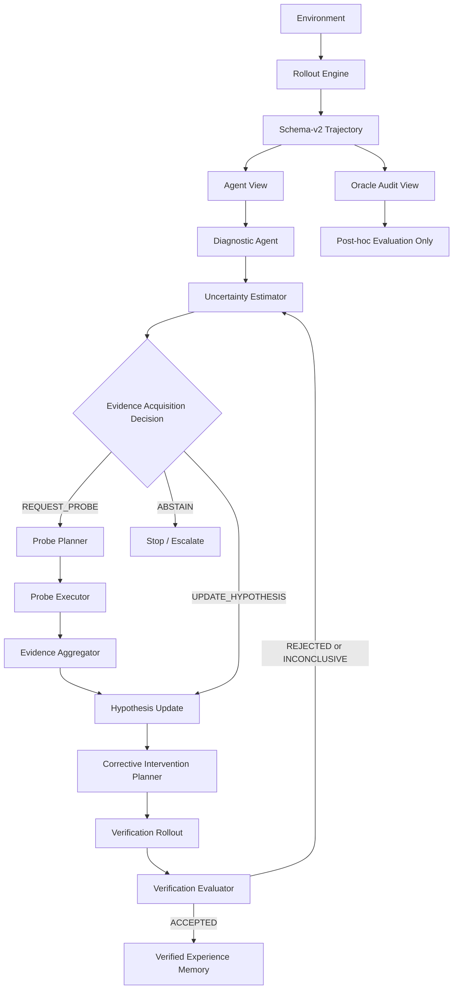

# Active-Evidence Agent Architecture

## Overall pipeline

## Responsibilities

| Module | Responsibility | Must not do |
|---|---|---|
| rollout | Execute an environment episode and return transitions | Diagnose faults |
| trajectory | Preserve aligned state-action-next-state records and data views | Infer mechanisms |
| diagnosis | Represent and revise mechanism hypotheses | Read Oracle labels |
| uncertainty | Quantify missing evidence and authorize the next information action | Execute probes |
| probe | Plan and execute bounded diagnostic interactions | Accept interventions |
| reasoning | Enforce lifecycle order and evidence provenance | Control robot timesteps |
| planner | Propose a bounded corrective intervention from current hypotheses | Write memory |
| verification | Evaluate a new rollout against declared criteria | Retune historical results |
| memory | Store only accepted verified experience | Store unverified hypotheses |
| evaluation | Compare methods using Agent and post-hoc Oracle metrics | Feed Oracle truth to Agent |
| visualization | Materialize plots/videos from recorded artifacts | Hand-write results |

## Information boundary

Agent-facing modules may receive observations, commanded actions, next observations,
rewards, success state, task-progress metrics, evidence provenance, and budgets.
Injected perturbation kind/axis/magnitude, perturbed actions, executed actions, and
clipping audit remain outside the decision path. Oracle information can score a
hypothesis after execution but cannot create it.

## Rollout lifecycle

1. Execute the nominal policy and save schema-v2 transitions.
2. If successful, close the cycle without diagnosis.
3. If failed, create an Agent-visible failure evidence packet.
4. Estimate epistemic and aleatoric uncertainty.
5. Record an explicit decision: update the hypothesis, request a probe, or abstain.

## Probe lifecycle

1. A probe plan identifies the uncertainty it targets, expected observation, step
   budget, stop conditions, and safety constraints.
2. Execution requires a preceding `REQUEST_PROBE` decision identifier.
3. The executor returns Agent-visible transitions plus interaction cost.
4. Evidence aggregation records what prediction was supported or contradicted.
5. The diagnostic agent creates a hypothesis revision; it never overwrites history.

## Intervention and verification lifecycle

1. The planner binds an intervention to a specific active hypothesis and prediction.
2. Before execution, it declares measurable verification criteria and a budget.
3. A fresh rollout evaluates the intervention under the normal causal boundary.
4. The result is `ACCEPTED`, `REJECTED`, or `INCONCLUSIVE`.
5. Only `ACCEPTED` results can construct a `VerifiedExperience` memory entry.
