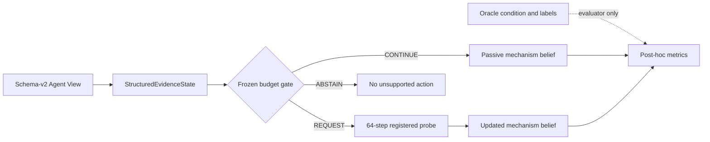

# Milestone A: Frozen Budgeted Evidence Allocation

## Research question

Given one registered diagnostic probe, can an attempt-level embodied decision
layer request it only when its expected diagnostic value justifies 64 additional
environment steps?

The robot policy is fixed (`SawyerPushV3Policy`). The Agent does not perform
step-level planning or update policy weights. It operates between rollout
attempts over schema-v2 Agent View evidence.



## Frozen evaluation

- Task: MetaWorld `push-v3`.
- Full collection: 10 seeds (330--339) x 5 registered execution conditions =
  50 initial rollouts.
- Operational population: 33 failed initial rollouts requiring a decision.
- Probe: one 64-step repeated symmetric XY protocol.
- Phase allocation threshold: `0.91612970415368`, frozen before held-out use.
- Manifest: `a39271db862f28574ad9eb47de4b2bf476950b58749b21baaac59117cf75981c`.
- Source commit: `c656ad787e5d77174ecbf8e76cdaf9c1b6ac1dab`.
- Rendering and API calls: disabled.

## Results

Results below are read from the immutable run's CSV/JSON artifacts.

| Method | Accuracy | Balanced accuracy | Probe requests | Probe steps |
|---|---:|---:|---:|---:|
| Passive | 87.9% | 66.7% | 0/33 | 0 |
| Seeded random probe | 97.0% | 91.7% | 27/33 | 1,728 |
| Always probe | 100.0% | 100.0% | 33/33 | 2,112 |
| Global temporal gate | 100.0% | 100.0% | 32/33 | 2,048 |
| Frozen phase-conditioned gate | 100.0% | 100.0% | 7/33 | 448 |
| Oracle audit | 100.0% | 100.0% | 4/33 | 256 |

The frozen phase gate preserved the always-probe mechanism accuracy while using
1,664 fewer diagnostic environment steps (78.8% lower probe cost). Including the
shared initial rollout cost, total physical interaction decreased from 18,612 to
16,948 steps. Its request rate was 21.2%, and three of seven requests were
unnecessary under the strict evaluator label.

The evaluator-only `diagnostic_probe_needed` label had 4 positives and 29
negatives in the operational population. Phase inconsistency achieved ROC AUC
0.966 and PR AUC 0.830. On the 12-unit passively matched subset, phase versus
always-probe diagnosis was 0 wins / 12 ties / 0 losses. The paired mean probe-cost
difference was -32.0 steps per unit with a 95% stratified bootstrap interval of
[-42.67, -16.0].

Median Agent computation was 125.20 ms per case, dominated by building the
structured evidence state (125.18 ms); the median allocation decision itself was
0.023 ms. Environment rollout time is excluded.

## Representative causal case

The representative case is selected by a reproducible rule: the lexicographically
first operational unit where passive diagnosis is wrong, the phase gate requests
the probe, and the registered probe corrects the mechanism decision.

```text
heldout_case_0043, seed 332
initial failure
-> phase inconsistency 0.985459
-> REQUEST_DIAGNOSTIC_PROBE
-> 64-step repeated probe, consistency score 0.872700
-> passive belief: stable_bias
-> post-probe belief: stochastic_noise
-> evaluator mechanism: stochastic_noise
```

This demonstrates a genuine evidence-to-belief change. Phase 2 does not yet show
that the changed belief improves corrective intervention; that is the independent
P1 question and requires matched fresh verification.

## Leakage and limitations

All 50 structured states and all 50 probe contexts were recursively checked by
the repository's leakage validator. No condition, perturbation, Oracle mechanism,
raw/perturbed/executed action, or evaluator label appeared in Agent evidence.

The four positive probe-need cases all belong to the stochastic-noise mechanism;
the stable-bias stratum has no positive labels. Therefore this run supports
selective allocation of this fixed probe under the registered benchmark, not a
claim of general failure understanding. Probe evidence was collected
counterfactually for evaluation, but only requested probes are charged to each
method's online cost. No verification or recovery claim is made here.

MetaWorld emitted its known observation-space and action-clipping warnings. No
episode crashed, and all 50 collection units completed.

## Reproduction

```bash
python scripts/generate_heldout_manifest.py
python scripts/run_frozen_heldout_allocation.py --manifest \
  outputs/heldout_allocation/runs/heldout_20260731T015847Z_a39271db862f/manifest.json
python scripts/plot_heldout_allocation.py --run-dir \
  outputs/heldout_allocation/runs/heldout_20260731T015847Z_a39271db862f \
  --output outputs/figures/evidence_allocation_frontier.png
```

The first command creates a new run ID and therefore will not reproduce the
literal path above. Existing held-out artifacts are never overwritten.
